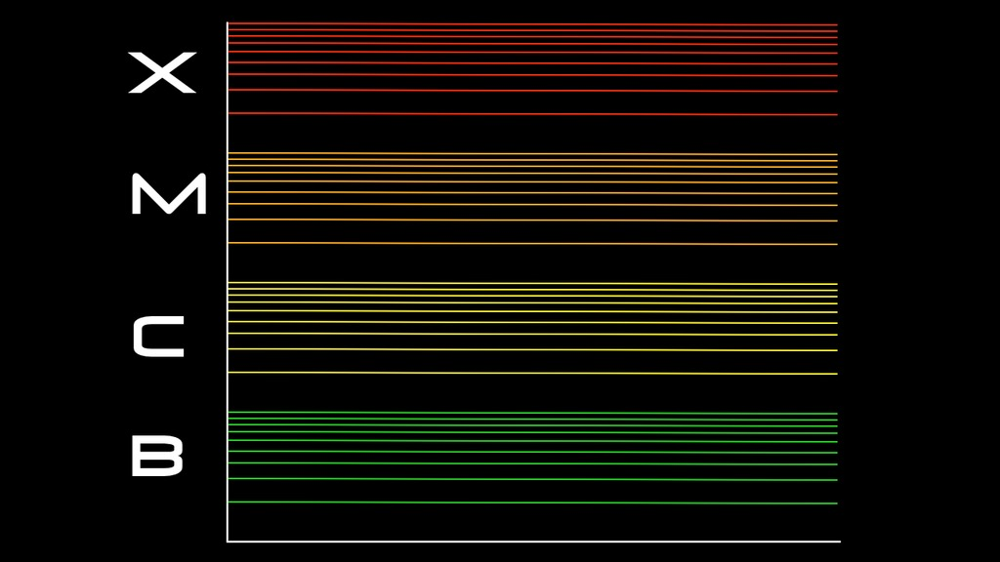
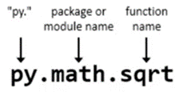
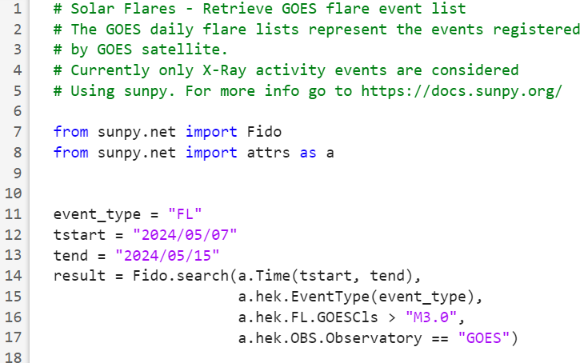
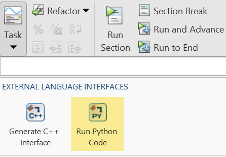
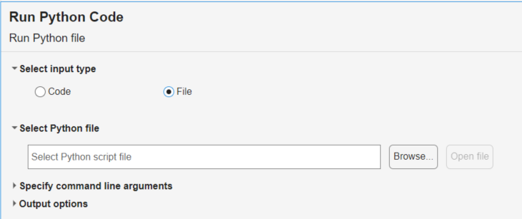
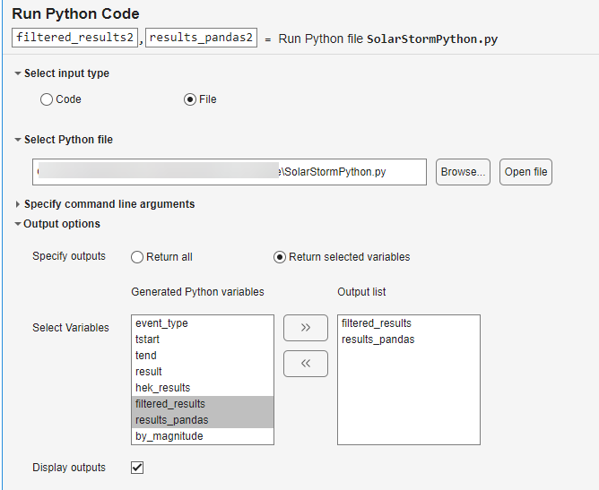

[](https://matlab.mathworks.com/open/github/v1?repo=MariaGavilan/solar_flares&file=SolarFlares_Analysis_MATLABPython.mlx)

# Analyzing solar flares with MATLAB and Python
<a name="beginToc"></a>

## Table of Contents
&emsp;[Project Context](#project-context)
 
&emsp;[Check your environment](#check-your-environment)
 
&emsp;[Basic syntax when using Python code in MATLAB](#basic-syntax-when-using-python-code-in-matlab)
 
&emsp;[Access solar flare data with sunpy](#access-solar-flare-data-with-sunpy)
 
&emsp;&emsp;[**Pause \- Add your task "Run Python Code" here**](#-underline-textbf-pause-add-your-task-run-python-code-here-)
 
&emsp;&emsp;[**Use the information from Solar Flares in MATLAB**](#-textbf-use-the-information-from-solar-flares-in-matlab-)
 
<a name="endToc"></a>

# Project Context 

The year 2024 was the solar maximum where the sun's 11\-year activity cycle peaked. This meant more frequent and intense northern lights, which went as far south as Florida, U.S. and northern India.  *(Photo taken from* [*National Geographic*](https://www.nationalgeographic.com/science/article/auroras-solar-maximum-2024)*)*  


The northern lights are the visible result of solar flares, which are intense and localized emissions of electromagnetic radiation in the Sun's atmosphere. During a solar flare, our atmosphere on Earth stops the x\-rays from flares. However, they do disturb the Earth's ionosphere which in turn disturbs radio communications. How?


Well, solar flares occur when powerful magnetic fields, leaving and entering the sun, reconnect. They are usually associated with active regions, perceived as sunspots, where magnetic fields are the strongest. A scale is used to measure how large the spots and rashes are, where X is the top of the scale. X eruptions have the most potential to create problems in communication systems.





So, we need to gather data from the Sun. A very popular open source project to track observations of the Sun and the heliosphere is SunPy. This is the community Python library for solar physics, which includes quick access to open\-source solar data. The development of sunpy is closely associated with that of astropy (key package for astronomy using Python). 


 **In this project we will analyze data for the strongest solar flares using sunpy directly in MATLAB.** 

# Check your environment    

First let's confirm that MATLAB recognizes the Python interpreter on your machine:

```matlab
pyenv
```

Depending on our configuration, you can use arguments to this function to point to a specific interpreter in case you have access to more than one:

```matlab
%% pyenv(Version="C:\\path\to\specific\python.exe") 
```

Or to set the run mode to "OutOfProcess" which allows Python to be run in a separate process (for example, to prevent MATLAB from crashing if the Python code fails):

```matlab
%% pyenv(ExecutionMode = "OutOfProcess")
```

Now that you know that MATLAB can identify your specific Python interpreter, make sure all the Python packages needed for your project are properly installed in your system. In this case, we need the package sunpy, so let's get them installed running the setup script: 

```matlab
setup
```

# Basic syntax when using Python code in MATLAB

All Python functions in MATLAB have the same basic syntax:





Now let's use the py syntax to call functions (py . package . function(args)); no need to use "import":

```matlab
py.math.sqrt(42)
```

In MATLAB we can use the name=value syntax for arguments when calling Python functions. However, it is also important that we take into account the conversion of variable types:

```matlab
hw = py.textwrap.wrap("Hi everyone in this workshop!", width = int8(2))  %Try with int8 
```

Finally, convert to a MATLAB variable type if necessary:

```matlab
hwML = string(hw) 
```

# Access solar flare data with sunpy 

In MATLAB you can check the Python code stored .py files. In the MATLAB Editor you will notice the syntax highlighting of the Python code:


   


Let's review the Python code first! Open the file **SolarStormPython.py** and explore its content. 

```matlab
open 'SolarStormPython.py'
```


**Use the results in MATLAB**


In this MATLAB notebook, you can add tasks, which are simple point\-and\-click interfaces that can be added to a live script to perform a specific set of operations. Tasks represent a series of MATLAB® commands. You can display their output either inline or on the right. To see the MATLAB commands that the task runs, show the generated code.  Using the Live Task to include Python code we can make the process of using this file easier.  You can find the "**Run Python Code**" Live Task in the LIVE EDITOR tab, in the "Task" menu:





## **Pause \- Add your task "Run Python Code" here**


Once you have the task in your notebook, select "File" and browse to the python file called "`SolarStormPython.py`"





The Run Python Code task lets you interactively run Python code or files. The task automatically generates MATLAB code for your live script. Using this task you can: 

-  Execute code in Python files. 
-  Return Python variables to the MATLAB workspace. 
-  Pass MATLAB data to the Python code. 

Once you select the file, MATLAB will list the possible output variables that you can use in MATLAB. For this example, select **`filtered_results`** and **`results_pandas`** from the list, as shown below:




## **Use the information from Solar Flares in MATLAB**

We can review the output of the previous code segment by typing 'filtered\_results' in the code cell below, and running the cell:

```matlab
filtered_results
```

Now you can convert the pandas dataframe to a MATLAB table (starting on R2024a):

```matlab
md = table(results_pandas)
```

And we can inspect the table elements in more detail:

```matlab
class(md.hpc_radius)
```


How can I use this solar flare information? Since X\-rays from the strongest flares disrupt the ionosphere, it is important to understand how this impacts the design of communications systems.


